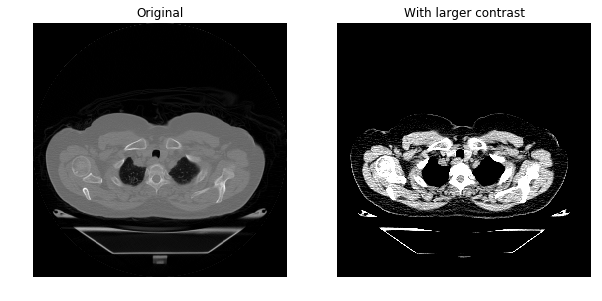
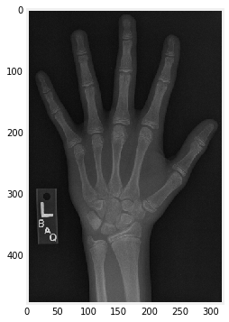

# About this Repo.

In this series we look at some fundamentals of Medical Image analysis using Python libraries like Scipy-image and visualize using MatplotLib. We analyse Medical images which are in this case human CT Scans of hand, chest or feet. These are some quick tricks to work around medical images which i hope will help in larger Medical Image processing and Data science classification and detection projects.

---
The data samples are the below xray images.  We look at chest and arriving at more contrast images. 

and also some hand xray images. 

I have made the whole repo reproducible along with the [data](/Data). The dataset is drawn from the [Sunnybrook Cardiac Atlas Project](http://www.cardiacatlas.org/studies/sunnybrook-cardiac-data/). It has been de-identified and used as training data in a number of different competitions. 

---
This analysis series is divided as follows, 

1. Exploring through images and plotting. Stacking images into a 3D volume. [Notebook](/Image_Exploration.ipynb)

2. Applying Masks and filters to an Image. [Notebook](/Masking_and_filtering.ipyng). Here we also look at detecting edges in a Image and applying smoothing techniques. 

